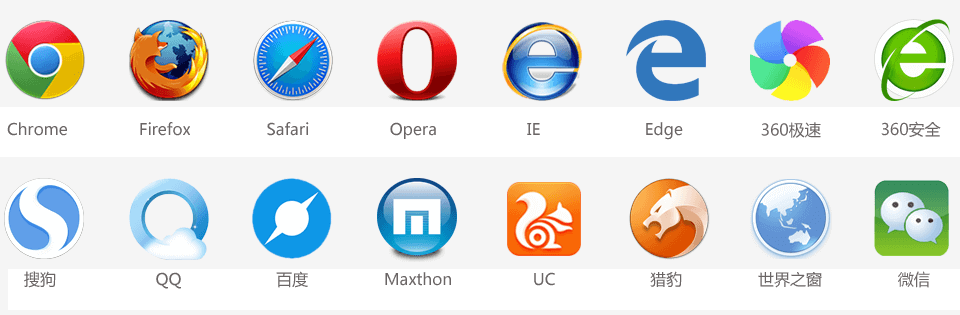
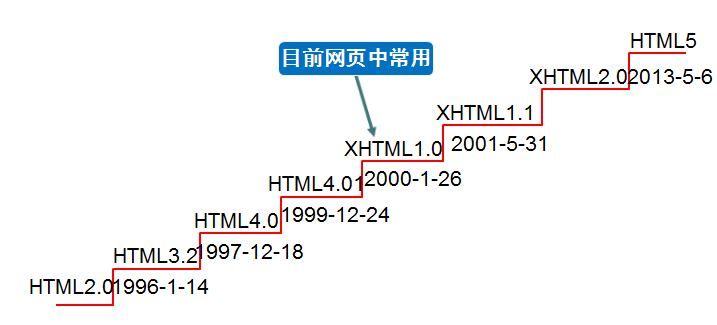

## 1 Web、网页、浏览器

#### 1.1 Web

Web（World Wide Web）即全球广域网，也称为万维网。

- **Web组织**

**W3C**：万维网联盟组织，用来制定web标准的机构（组织）。

- **Web标准**

**Web标准**：制作网页要遵循的规范。

**web标准包括三个方面：**

- 结构标准：用于对网页元素进行整理和分类。
- 表现标准：用于设置网页元素的版式、颜色、大小等外观样式。
- 行为标准：用于定义网页的交互和行为。

也就我们常说的HTML、CSS、JS

- HTML（HyperText Markup Language）：超文本标记语言。从**语义**的角度描述页面的**结构**。相当于人的身体组织结构。
- CSS（Cascading Style Sheets）：层叠样式表。从**审美**的角度美化页面的**样式**。相当于人的衣服和打扮。
- JS：JavaScript。从**交互**的角度描述页面的**行为**。相当于人的动作，让人有生命力

> 举个例子：一个人的的身材就相当于HTML，穿搭就是CSS，进行各种活动就是JS

为什么需要遵循W3C标准？

因为市面的很多浏览器的内核不同，导致解析的结果可能存在差异，给开发者增加无谓的工作量，统一的标准能减少工作量。

#### 1.2 网页

**网页是构成网站的基本元素**。网页主要由文字、图像和超链接等元素构成。当然，除了这些元素，网页中还可以包含音频、视频以及Flash等。

在浏览器打开的网址，其中任何一个界面都属于网页

#### 1.3 浏览器

- **常见的浏览器**

浏览器是网页运行的平台，常见的浏览器有谷歌（Chrome）、Safari、火狐（Firefox）、IE、Edge、Opera等。如下图所示：

- **浏览器的组成**

主要有两部分组成：**渲染引擎（浏览器内核）**和**JS引擎**

**渲染引擎（浏览器内核）:**

用来解析 HTML与CSS。渲染引擎决定了浏览器如何显示网页的内容以及页面的格式信息。

**JS引擎**

也称为 JS 解释器， 用来解析网页中的JavaScript代码，对其处理后再运行

## 2 初识HTML

#### 2.1 HTML概述

**HTML** 全称为 HyperText Markup Language，译为**超文本标记语言**。

HTML 不是一种编程语言，是一种描述性的**标记语言**。

**作用**：HTML是负责描述文档**语义**的语言。

- **概念：超文本**

所谓的超文本，就是图片、音频、视频、动画、多媒体等内容，成为超文本，因为它们超出了文本的限制，还有链接，从一个文件跳转到另一个文件，也叫超级链接文本。

- **概念：标记语言**

HTML 不是一种编程语言，是一种描述性的**标记语言**

（1）**标记语言是一套标记标签**。比如：标签`<h2>`表示二级标题、标签`<a>`表示超链接、标签``图片等

> 网页是由网页元素组成的，这些元素是由 HTML 标签描述出来，然后通过浏览器解析。

（2）编程语言是有编译过程的，而标记语言**没有编译过程**，HTML标签是直接由浏览器解析。

#### 2.2 HTML历史

**XHTML介绍：** XHTML：Extensible Hypertext Markup Language，可扩展超文本标注语言。 XHTML的主要目的是为了**取代HTML**，也可以理解为HTML的升级版。

#### 2.3 常用名词说明

- 网页 ：由各种标记组成的一个页面就叫网页。
- 主页 : 一个网站的起始页面或者导航页面。
- 标签： 比如`
`称为开始标签 ，`
`称为结束标签 。每个标签都规定好了特殊的含义。
- 元素：比如`
元素
`称为元素.
- 属性：给标签附加一些辅助信息。
- XHTML：符合XML语法标准的HTML。
- DHTML：结合`javascript + css + html`的页面就是DHTML。D：dynamic，动态的，也可以理解为动态HTML
- HTTP：超文本传输协议。用来规定客户端浏览器和服务端交互时数据的一个格式。
- SMTP：邮件传输协议。
- FTP：文件传输协议。

#### 2.4 第一个HTML

#### 2.5 HTML结构

#### 2.6 计算机编码

## 3 编辑器介绍

前端开发的编辑器中，有很多VS Code、Sublime Text、WebStorm等，现在主流的也就这三个。

本人第一次使用的VS Code，也一直使用到现在，感觉挺容易上手。

还有Sublime Text、WebStorm。

PS：个人认为什么熟悉就用什么

**VS code 的使用**

[第一次使用VS Code时你应该知道的一切配置](https://github.com/qianguyihao/Web/blob/master/00-前端工具/01-VS Code的使用.md)

**Sublime Text 的使用**

[Sublime Text使用技巧](https://github.com/qianguyihao/Mac/blob/master/05-全平台软件/Sublime Text使用技巧.md)

**WebStorm的使用**

[WebStorm使用教程](https://blog.csdn.net/zyx_ly/article/details/90409902)

